## My Robotic Journey

---

<!--This automatically creates a line below ## Header-->
<!--This is a comment-->

My journey into robotics started when I was six years old and got my first [LEGO Mindstorms EV3](https://en.wikipedia.org/wiki/Lego_Mindstorms_EV3) kit. I was amazed that I could build all kinds of models with LEGO pieces and bring them to life controlled by the brick.  As I played and experimented, I started changing parts to create different movements and give each robot its own special job. This hands-on fun sparked my curiosity and became the starting point of my passion for robotics.

 

*Me meddling with my first robot.*

When I started taking robotics lessons with the [LEGO SPIKE Prime](https://education.lego.com/en-us/product-resources/spike-prime/troubleshooting/spike-prime-faqs/#:~:text=™%20Prime%20FAQs-,General,to%20becoming%20resilient%2C%20independent%20thinkers) (successor of LEGO Mindstorms EV3), I became even more excited about how sensors could be used to control the robots I built. I also learned how important the design is for making the robot more stable and work better. These lessons made me even more curious and helped grow my love for robotics.

My first robotics competition was the [IDE Series](https://ideseries.org/#intro) in 2023, where I took part in the Robotics Category. It was an eye-opening experience and I was amazed to see so many students who shared the same passion for robotics. During the competition, I learned how important teamwork is, as my teammates and I worked closely together to get the best robot run we could. Even though we finished in 7th place, I’m really proud of what we achieved and thankful for everything I learned from the experience.

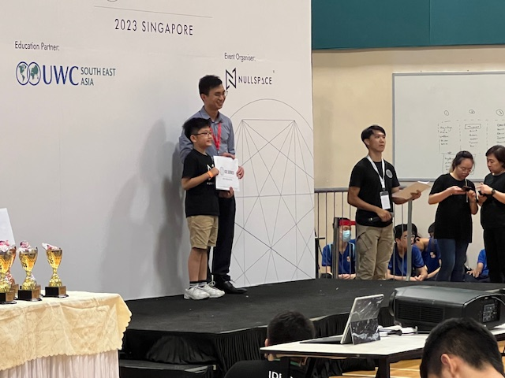 

*Receiving my 7th position certificate at the IDE 2023.*

In 2023, I took part in the [National Robotics Competition (NRC)](https://www.science.edu.sg/for-schools/competitions/national-robotics-competition), where I was introduced to more detailed task requirements, a larger playing field, and the need to present our learning journey. It was a more demanding competition and required a longer preparation time. My team and I worked closely together, constantly making adjustments to both our robot and our presentation.

We felt confident on the day of the competition, but unfortunately, our robot didn’t perform as well as it had during practice, possibly due to dust that had built up on the playing field. Although we didn’t make it to the final round, we were thrilled to be awarded 3rd place for Best Presentation and Best Programming. We learned a lot from this experience and promised ourselves we would return in 2024.

For NRC 2024, the theme was water conservation, and we started preparing early. We made great progress with both our robot and our presentation. We also spent more time researching how to conserve water and learned many ways to help protect this precious resource. Using what we learned from 2023, we improved the robot’s stability and traction, which helped us perform well and reach the final round.

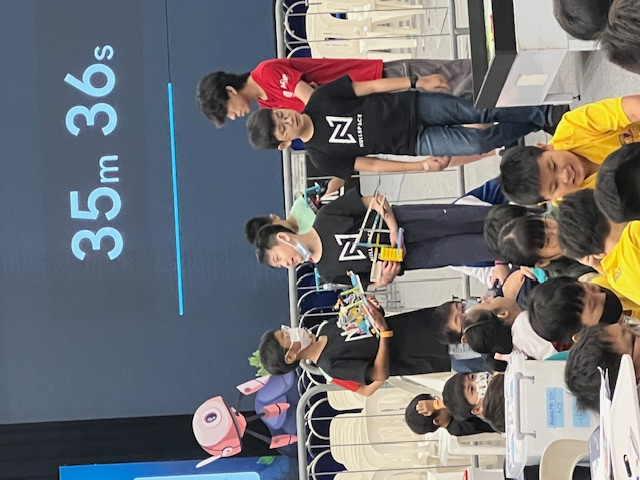 

*Waiting patiently to perform a robot test run at the NRC 2024.*

Unfortunately, during the final run, a piece of LEGO got stuck under the robot, stopping it from completing the task. While we were disappointed, we understood that unexpected issues can happen and that the best way forward is to learn from them. Despite the setback, we were proud to be awarded 3rd place once again for our Learning Journey presentation.

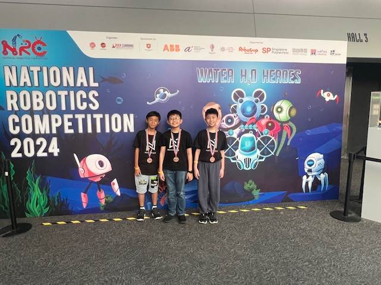 

*My team, 3rd for the Learning Journey Presentation.*

## My Coding Journey

---

### C++ with Arduino

I began my journey into coding with C++ through the Arduino [Elegoo Uno R3 Starter Kit](https://www.elegoo.com/blogs/arduino-projects/elegoo-uno-r3-project-the-most-complete-starter-kit-tutorial). This kit gave me the chance to mix coding with electronics, which made learning really fun and exciting. I was able to build cool projects with lights, sensors, and more. That got me super interested, so I started taking Arduino lessons, and soon, I was making things I never thought I could!

Here are some of the projects I have done:

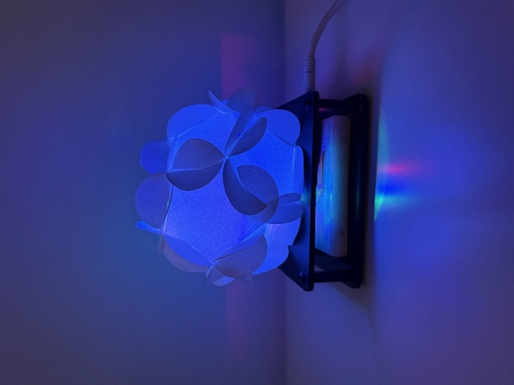 

*A night lamp that changes colours.*

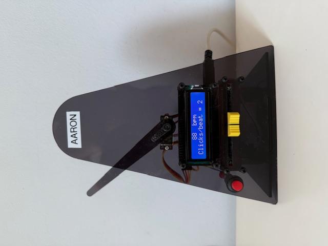 

*A digital metronome with adjustable tempo, perfect for music practices.*

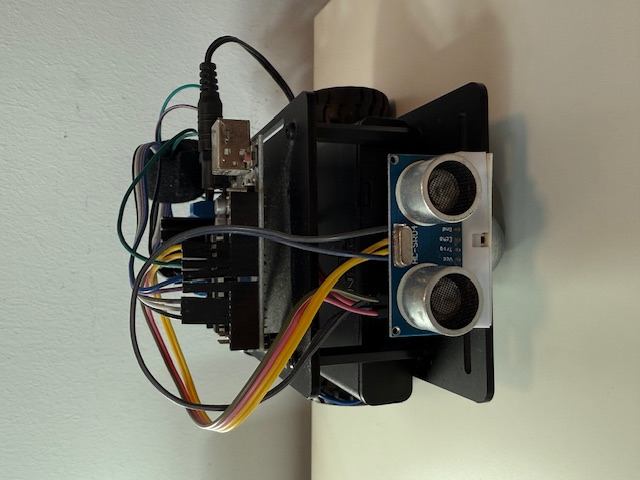 

*A robot car that avoids obstacles.*

<!--Original Paragraph:-->

Armed with what I learnt from Arduino, I built a smart recycling bin for the visually impaired using recycled materials and electronic components. The bin uses Servo Motors to control a set of flaps that sort and direct items into the correct bins with just the press of a button. Each button is labeled in braille, so it’s accessible to visually impaired users.

I also added a Liquid Crystal Display (LCD) to show what button was pressed and the current status of the bins. To make it even more user-friendly, I included a buzzer that plays different beep patterns: one to confirm the button press and another low beep to alert when a bin is full. This project helped me understand how coding and electronics can work together to solve real-world problems!

This project was submitted to Tan Kah Kee Young Inventor's Award Competition (TKKYIA). Unfortunately, it was not selected for the interview round. Though I was a bit disappointed, I told myself to look at the bright side of things and try to test the recycling bin with visually-impaired users and this may allow them to recycle with ease.

Click the play button for the video presentation for the recycling bin!

[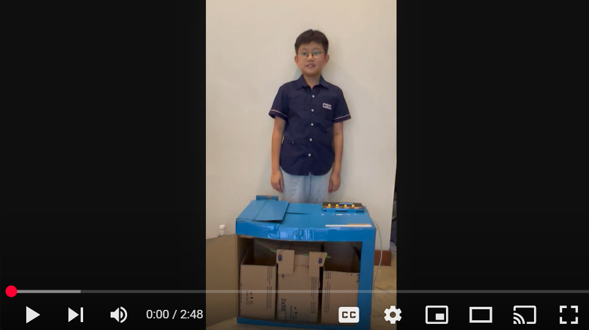](https://www.youtube.com/watch?v=84SNMB3cBoc)

### Python

After starting my coding journey with C++, I soon became curious about Python. Driven by that curiosity, I began teaching myself by reading books and experimenting with simple projects. As I learned more, I discovered how powerful and versatile Python is—from building apps to automating everyday tasks. To deepen my understanding, I enrolled in Python coding lessons and continued expanding my skills. Learning Python has opened up a whole new world of possibilities for me, and I’m excited to keep exploring where it can take me!

Here are some of my Coding Projects:

* **🎲 Magic 8-Ball**: A fun micro:bit script that simulates the classic Magic 8-Ball toy, generating random numbers

* **🧮 BMI Calculator**: An application that calculates Body Mass Index based on user input, helping understand health metrics through code.

* **☕ Caffeine Intake Tracker**: A program designed to monitor daily caffeine intake, combining health awareness with programming practice.

* **🔢 Python Quiz Series**: A set of Python scripts that generate general knowledge quizzes, helping me strengthen both my general knowledge and coding logic.

* **🛒 Shopping App**: A simple application that simulates a shopping experience, introducing concepts of item selection and budgeting.

* **🎮 Python RPG**: An early attempt at creating a text-based role-playing game, exploring storytelling and user interaction through code.

* **🏫 School Database**: A project aimed at managing student records, grades, and attendance, delving into data handling and storage.

* **🚗 Robot Car Design**: A conceptual design document for a robot car, merging interests in robotics and programming.

* **📱 WhatsApp Clone**: An endeavor to recreate basic messaging functionalities, understanding communication protocols and user interfaces.

Click [here](https://github.com/tkyaaronRM/projects) for my collection of coding projects

## My Music Journey

---

### Musical Beginnings

My musical journey began when I was four and a half, with my first piano lessons - a moment that sparked my love for music. Learning the piano at such a young age gave me a strong foundation in music, helping me develop a good sense of rhythm, pitch, and coordination. It also taught me important skills like sight-reading and finger dexterity, which became really useful when I started learning other instruments - especially the violin. Just a year later, I picked up the violin and quickly discovered a deep passion for both instruments. Starting music so early has shaped a journey that’s been both exciting and meaningful, and it continues to be a big part of who I am today.

### Achievements and Recognition

By the time I was nine, I had achieved an ABRSM Grade 8 Merit in Violin, followed by a Grade 8 Distinction in Piano at age ten. When I was eleven, I earned the Associate of Trinity College London (ATCL) Diploma in Violin Performance. These milestones opened up more opportunities for me, including participating in music competitions and becoming a member of my school’s String Ensemble.

I started entering competitions at a young age. One of my earliest memories is winning a Gold Award at the Asia Music Festival when I was just six years old. At eight, I competed in the Mandeville Music Awards and was proud to receive Gold Awards in both Violin and Piano, along with a special Double Commendation Award.

In 2024, I was honored to receive Gold Awards at both the Singapore Raffles Music Festival and the SMTA Performers' Festival & Chamber Music Competition. I also had the exciting opportunity to compete internationally. That same year, I won First Prize in the International Music Competition Oxford “Grand Prize Virtuoso” (Junior Category). In 2025, I was awarded First Prize in the American Protégé International Piano & Strings Competition and received Second Prize in The New York Classical Music Competition for Violin (Young Performers II category)—where no First Prize was awarded that year.

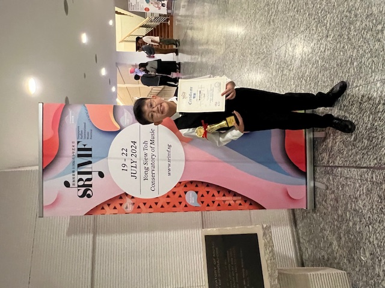)

In addition to practicing my instruments, I chose to explore music theory in greater depth. I took formal lessons in both theory and composition, and eventually achieved ABRSM Grade 6 Music Theory with Merit. Studying theory helped me understand how music works beyond just playing the notes—it gave me insight into how pieces are structured and how composers express their ideas. This deeper understanding has allowed me to interpret music more thoughtfully. Together, my practical training and theoretical studies have shaped me into a more well-rounded and expressive musician.

### Highlights of Performances

I love performing with like-minded friends and have taken part in many public recitals, sharing my music with different audiences. One of my most memorable performances was at the Bach in the Subway event, where I played a piano solo and also performed the Bach Double Concerto with a mini-ensemble.

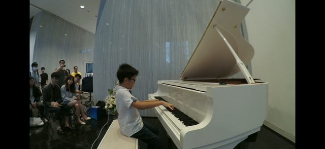

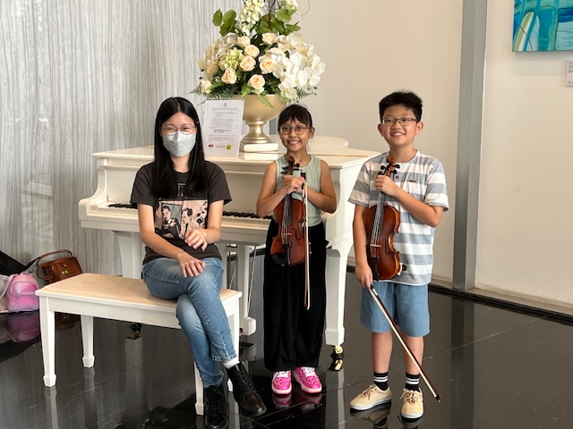 

*Performing at the Bach in the Subway*

Recently, I started exploring chamber music and had my first public performance in January 2025, where I played the first movement of the Borodin String Quartet. It was a wonderful experience, and I was fascinated by how four different instruments, each playing its own part, could come together to create such beautiful, harmonious music.

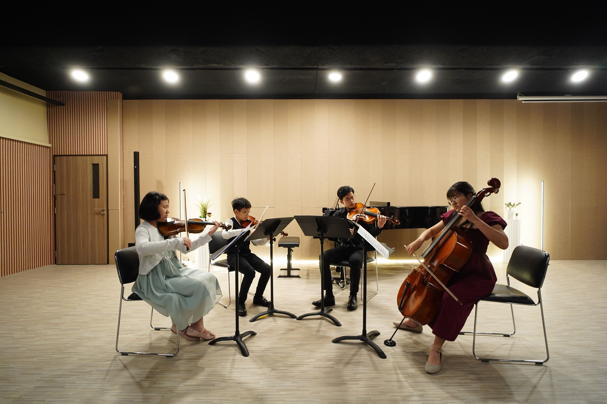

I’m also currently working with Alexandra Hospital to organise a performance in July 2025 for the staff and patients. The program will include a mix of solo and chamber pieces, featuring both classical works and some familiar, well-loved tunes. 

### String Ensemble

I was first accepted into the NYPS Senior String Ensemble through an audition when I was in Primary One (2020). However, due to COVID-19, all activities for lower primary students were put on hold. I rejoined in Primary Three (2022) and was honoured to be part of the Senior Ensemble, First Violin section. That same year, we performed at the Singapore Youth Festival (SYF) Arts Presentation.

Being part of the String Ensemble taught me how important teamwork is — how to play as part of a group, not just as a soloist. I learned to listen closely, coordinate with my teammates, and follow the conductor’s lead. In 2024, I had the chance to perform with the ensemble at the SYF Arts Presentation again, and we were proud to receive a Certificate of Distinction for our performance.

In 2024, I was appointed Assistant CCA Leader of the String Ensemble, and in 2025, I was honored to take on the role of CCA Leader and Concertmaster. I’m truly grateful for the opportunity to lead and contribute more meaningfully to the ensemble. This experience has taught me how to guide my peers with confidence, support them through challenges, and inspire everyone to give their best, both in rehearsals and on stage.

### Future Aspirations

I hope to continue growing as a musician by collaborating with like-minded peers in ensembles and orchestras, and by embracing new challenges through chamber music. More importantly, I want to share my music with others and bring joy to the community, especially to patients in hospitals who are going through difficult times. I believe that live music has the power to comfort, uplift, and heal, and I hope to use that power to make a meaningful difference in people’s lives.

My performance of the Beethoven Spring Sonata (press the play button):

[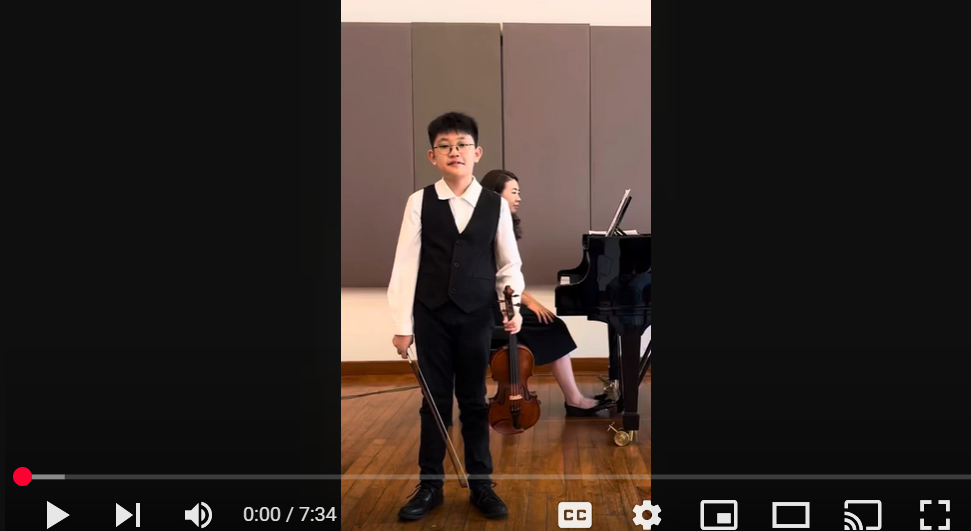](https://youtu.be/T7e8JDK8MRA)
