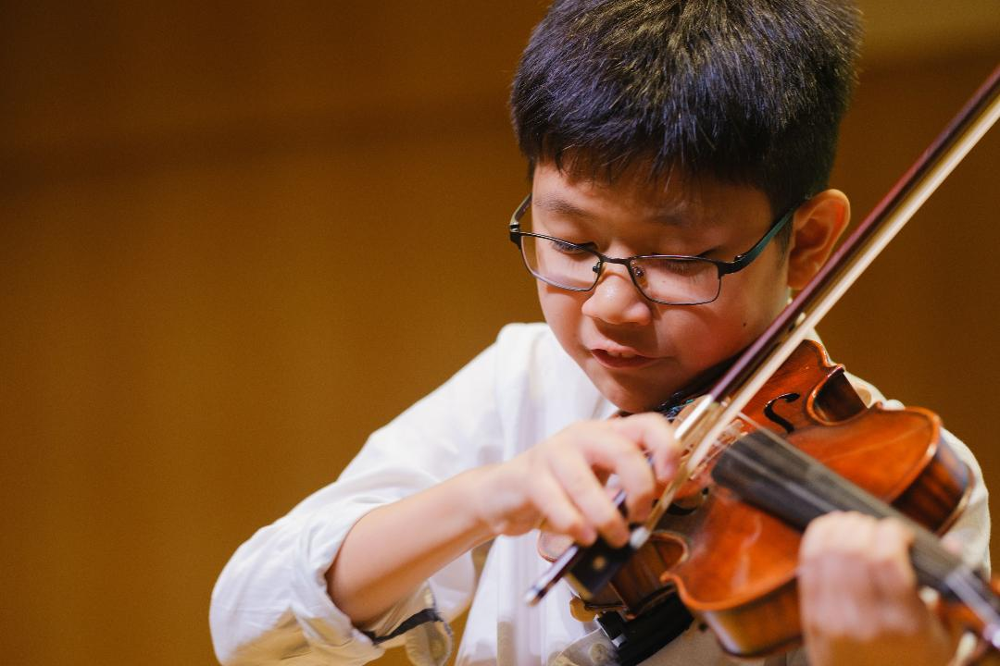

## My Robotic Journey

<!--This automatically creates a line below ## Header-->
<!--This is a comment-->

My journey into robotics started when I was six years old and got my first [LEGO Mindstorms EV3](https://en.wikipedia.org/wiki/Lego_Mindstorms_EV3) kit. I was amazed that I could build all kinds of models with LEGO pieces and bring them to life controlled by the brick.  As I played and experimented, I started changing parts to create different movements and give each robot its own special job. This hands-on fun sparked my curiosity and became the starting point of my passion for robotics.

When I started taking robotics lessons with the [LEGO SPIKE Prime](https://education.lego.com/en-us/product-resources/spike-prime/troubleshooting/spike-prime-faqs/#:~:text=™%20Prime%20FAQs-,General,to%20becoming%20resilient%2C%20independent%20thinkers)(successor of LEGO Mindstorms EV3), I became even more excited about how sensors could be used to control the robots I built. I also learned how important the design is for making the robot more stable and work better. These lessons made me even more curious and helped grow my love for robotics.

My first robotics competition was the [IDE Series](https://ideseries.org/#intro) in 2022, where I took part in the Robotics Category. It was an eye-opening experience and I was amazed to see so many students who shared the same passion for robotics. During the competition, I learned how important teamwork is, as my teammates and I worked closely together to get the best robot run we could. Even though we finished in 7th place, I’m really proud of what we achieved and thankful for everything I learned from the experience.

In 2023, I took part in the National Robotics Competition (NRC), where I was introduced to more detailed task requirements, a larger playing field, and the need to present our learning journey. It was a more demanding competition and required a longer preparation time. My team and I worked closely together, constantly making adjustments to both our robot and our presentation.

We felt confident on the day of the competition, but unfortunately, our robot didn’t perform as well as it had during practice, possibly due to dust that had built up on the playing field. Although we didn’t make it to the final round, we were thrilled to be awarded 3rd place for Best Presentation and Best Programming. We learned a lot from this experience and promised ourselves we would return in 2024.

For NRC 2024, the theme was water conservation, and we started preparing early. We made great progress with both our robot and our presentation. We also spent more time researching how to conserve water and learned many ways to help protect this precious resource. Using what we learned from 2023, we improved the robot’s stability and traction, which helped us perform well and reach the final round.

Unfortunately, during the final run, a piece of LEGO got stuck under the robot, stopping it from completing the task. While we were disappointed, we understood that unexpected issues can happen and that the best way forward is to learn from them. Despite the setback, we were proud to be awarded 3rd place once again for our Learning Journey presentation.

## My Coding Journey

Click [here](https://github.com/tkyaaronRM/projects) for my collection of coding projects

## My Music Journey

My performance of the Beethoven Spring Sonata:

